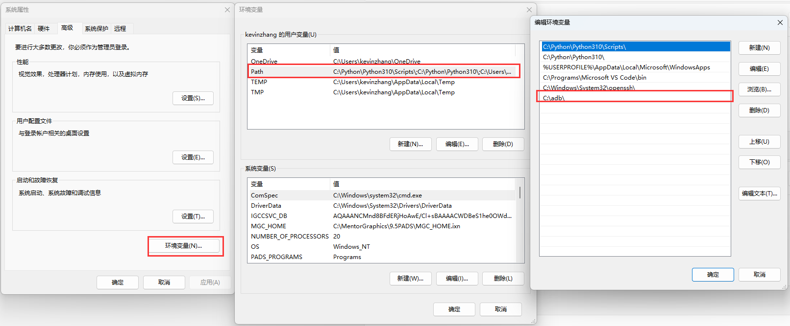
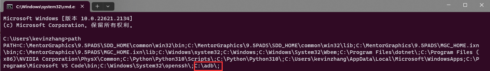
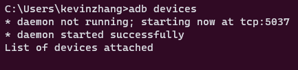
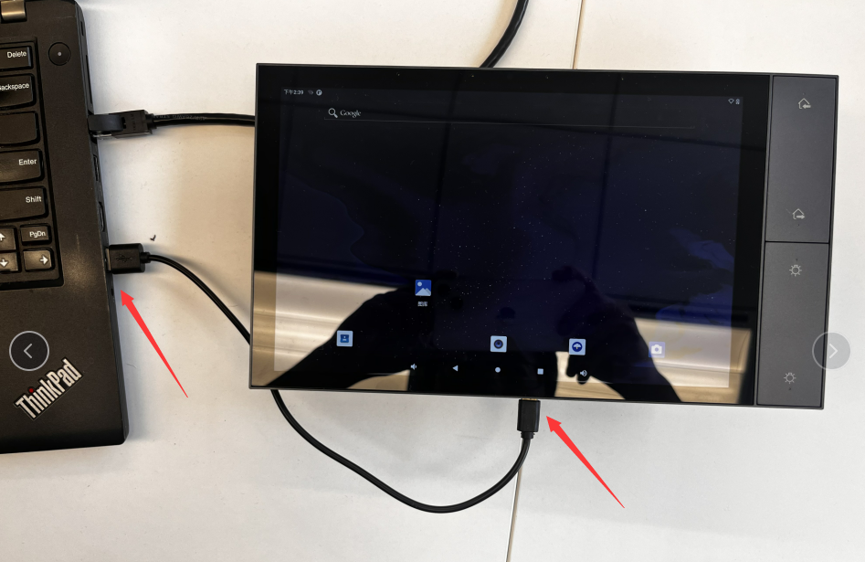
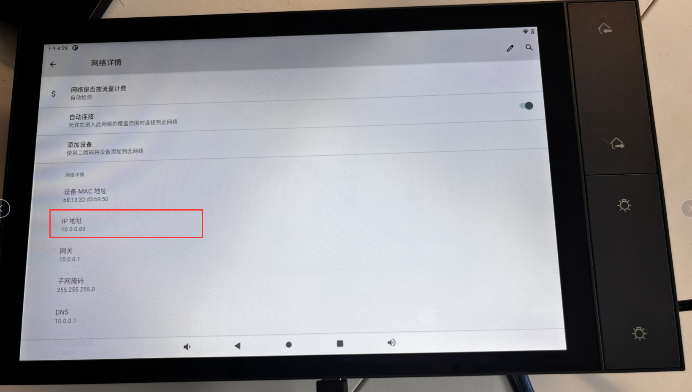
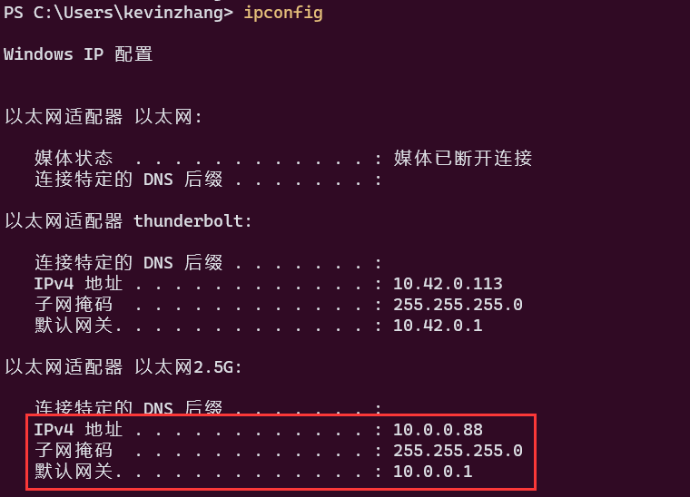
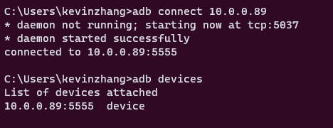

# Set up ADB on Windows by following the tutorial

Welcome to the official documentation hub for Rocktech’s embedded display and SBC solutions. This site includes configuration guides, hardware integration tutorials, and performance optimization tips for our Rockchip-based SBCs and TFT LCD modules.

---
## Install ADB on Windows

### 1. Download ADB installation file
It is recommended to use the version 1.0.41

[adb-v1.0.39.zip](../download/adb-v1.0.39.zip) version 1.0.39

[adb-v1.0.41.zip](../download/adb-v1.0.41.zip) version 1.0.41

### 2. Extract the contents of this ZIP file into an easily accessible folder (such as C:\adb).
```text
C:\adb
 |adb.exe
 |AdbWinApi.dll
 |AdbWinUsbApi.dll
```
### 3. Set the folder path(D:\adb) to the `PATH` system variable






### 4. Make sure install ADB succeeded
Open Command Prompt（cmd） and run command `adb devices`



## Use ADB on Rocktech Smart Device
### 1. Install the driver

&nbsp;SOC: PX30, RK3308, RK3288, RK3566, RK3568, RK3399
&nbsp;Smart Control Panel: RK-A4E, RK-A4ES, RK-A4EPL, RK-A6E, RK-A10E
&nbsp;[Rockchip USB Driver.zip](../download/Rockchip_USB_Driver.zip)

&nbsp;SOC: A23, A33, A64, A83T, H8, R16, R528
&nbsp;[Allwinner USB Driver.zip](../download/Allwinner_USB_Driver.zip)

### 2. Connect to the Smart Device 
there have two ways to connect to the Smart Device, You can choose any one according to the actual situation.
##### 2.1 Connect by USB usb data cable
	
&nbsp; &nbsp; 
	
##### 2.2 Connect by WiFi
Make sure both the Smart Device and the computer are both are connected to the same WiFi（or router）




Connect ADB by WiFi
```bash
adb connect 10.0.0.89
```



### 3. Push/Pull file
##### 3.1 push file to the Smart Device
```bash
adb push filename /sdcard/
```

##### 3.2 pull file from the Smart Device
```bash
adb pull /sdcard/filename .
```
### 4. Install app to the Smart Android Device
```bash
adb install xxxx.apk
```